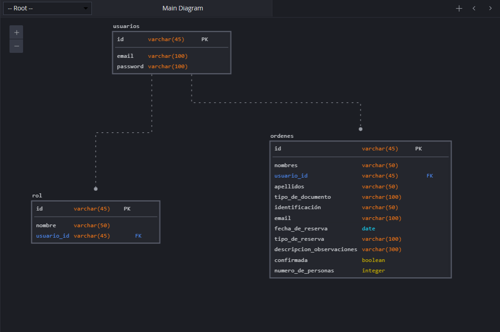

# Bienvenido al repo de Reservapp

Esta aplicación te permite tener un registro de las personas que han hecho reservas en tu sala de eventos!

## TechStack

- NodeJS
- Express
- MySQL
- Sequelize
- Angular

## Modelo de base de datos



### Setup de la base de datos

Crea un archivo de configuración "config.json" en el directorio src/config y en ese archivo pon la info de tu base de datos.

```javascript
{
  "development": {
    "username": "db_username",
    "password": "db_password_dev",
    "database": "reservapp_db_dev",
    "host": "127.0.0.1",
    "dialect": "mysql"
  },
  "test": {
    "username": "root",
    "password": null,
    "database": "database_test",
    "host": "127.0.0.1",
    "dialect": "mysql"
  },
  "production": {
    "username": "root",
    "password": null,
    "database": "database_production",
    "host": "127.0.0.1",
    "dialect": "mysql"
  }
}
```

Y ejecuta los siguientes comandos:

```bash
npm install
npx sequelize-cli db:migrate
npm run dev
```

Y eso es todo para ejecutar el backend! Al final deberías tener un mensaje en la terminal que se vea así:

```
> reservapp-backend@1.0.0 dev
> nodemon --exec babel-node ./src/app.js

[nodemon] 2.0.20
[nodemon] to restart at any time, enter `rs`
[nodemon] watching path(s): *.*
[nodemon] watching extensions: js,mjs,json
[nodemon] starting `babel-node ./src/app.js`
Executing (default): SELECT 1+1 AS result
Server successfully started!
```
