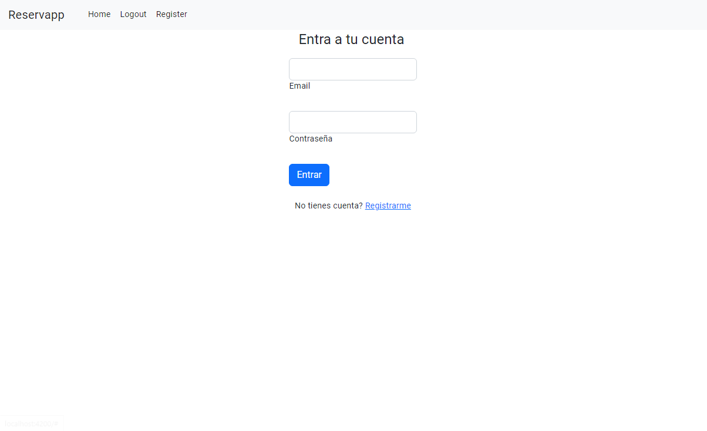
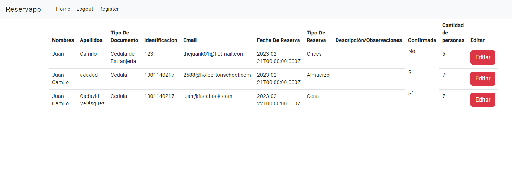
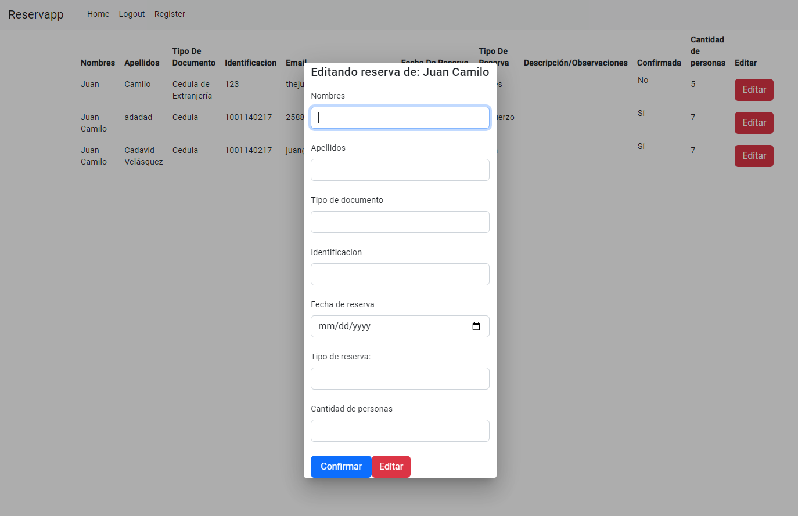
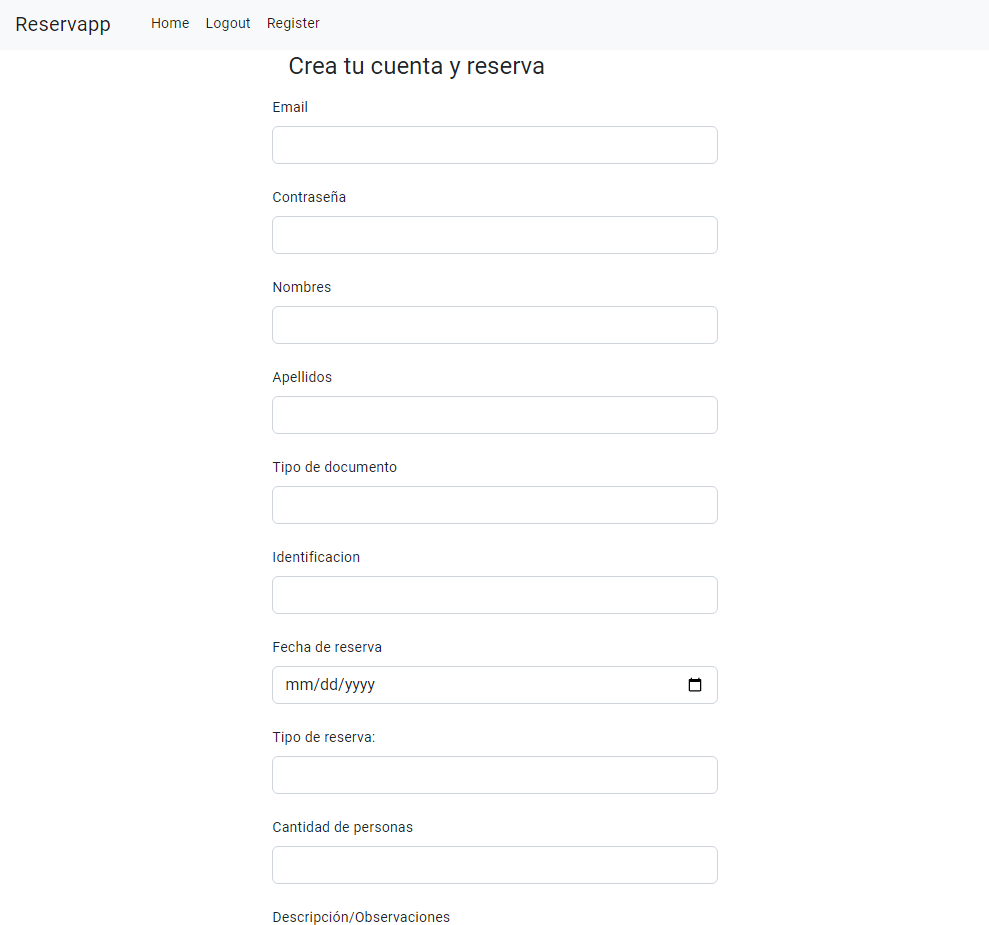

# Aquí te explico las diferentes vistas del frontent

### Home

Esta es la home page, en la cual puedes loggearte y si eres un usuario 'admin' o 'superusuario' vas a ser redireccionado al dashboard.

### Dashboard

En el dashboard puedes ver todas las reservas realizadas por los usuarios, tienes un botón de editar que abre un modal con diferentes campos para cambiar la orden.

### Modal para editar reserva

En el modal puedes escribir nuevos valores para actualizar la orden y usar el botón 'editar' para aplicar cambios(Este botón todavía no actualiza la reserva). También tienes el botón 'confirmar' para enviar un correo al usuario notificando que su reserva fue confirmada.

### Registro

Aquí puedes ingresar tus datos para crear tu cuenta y hacer una reserva, indicando los detalles de la reserva y la fecha.

